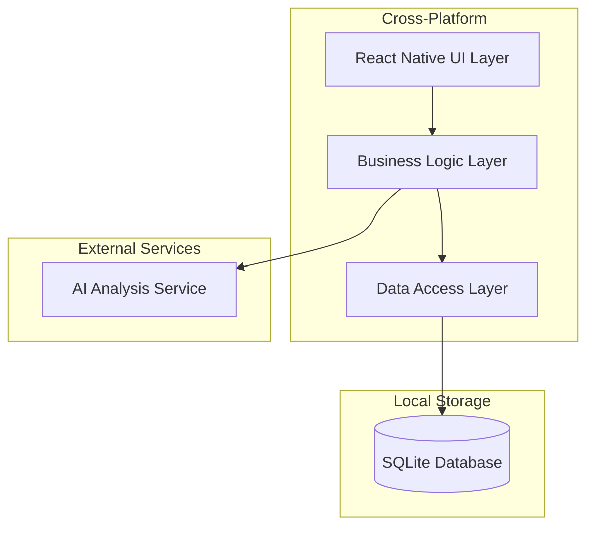

# Design Document

## Overview

The Food Analysis Mobile App is a cross-platform React Native application that provides users with AI-powered nutritional analysis of their daily meals. The app features a clean, intuitive interface for food input, real-time AI analysis, and comprehensive reporting capabilities. The architecture emphasizes offline-first functionality with local data storage and seamless cross-platform compatibility.

## Architecture

### High-Level Architecture



### Technology Stack

- **Frontend Framework**: React Native with TypeScript
- **Navigation**: React Navigation 6
- **State Management**: Redux Toolkit with RTK Query
- **Database**: SQLite with react-native-sqlite-storage
- **UI Components**: React Native Elements or NativeBase
- **AI Integration**: OpenAI API or similar nutrition analysis service
- **Build Tools**: Metro bundler, Flipper for debugging

### Cross-Platform Considerations

- Use React Native's built-in components for maximum compatibility
- Platform-specific styling using Platform.select() where needed
- Shared business logic across iOS and Android
- Platform-specific database paths handled by SQLite wrapper

## UI Design System

### Color Palette

#### Primary Colors
- **Primary/Theme Color**: `#75F5DB` (Mint Green)
- **Background Color**: `#75F5DB` (Light mint background)
- **Text Primary**: `#2D3748` (Dark gray for readability)
- **Text Secondary**: `#4A5568` (Medium gray)
- **White**: `#FFFFFF` (Pure white for cards and inputs)

#### Accent Colors
- **Success**: `#48BB78` (Green for positive indicators)
- **Warning**: `#ED8936` (Orange for neutral substances)
- **Error**: `#F56565` (Red for negative indicators)
- **Info**: `#4299E1` (Blue for informational elements)

#### Component Colors
- **Card Background**: `#FFFFFF` with subtle shadow
- **Input Background**: `#F7FAFC` (Light gray)
- **Button Primary**: `#75F5DB` (Theme color)
- **Button Secondary**: `#E2E8F0` (Light gray)
- **Border**: `#E2E8F0` (Light gray borders)

### Typography
- **Primary Font**: System default (San Francisco on iOS, Roboto on Android)
- **Heading Sizes**: 24px, 20px, 18px, 16px
- **Body Text**: 16px regular, 14px secondary
- **Button Text**: 16px medium weight

### Component Styling Guidelines
- **Border Radius**: 8px for cards, 6px for buttons and inputs, 10px for progress bars
- **Spacing**: 8px, 16px, 24px, 32px grid system
- **Shadows**: Subtle elevation for cards and modals
- **Button Height**: 48px for primary actions, 40px for secondary

### Enhanced Comparison Visualization Guidelines
- **Progress Bar Heights**: 4px for main consumption bars, 2px for reference lines
- **Typography**: 12px Roboto for substance names, 22px Roboto right-aligned for values, 8px Roboto light for units
- **Reference Indicators**: 2px circular dots positioned at reference values
- **Color Coding**: 
  - Primary consumption: `#75F5DB` (theme color)
  - Secondary layers: `#67C7C1`, `#509A9C` (gradient variations)
  - Reference lines: `#4A78CF` (blue for recommended), `#EA92BD` (pink for limits)
- **Layered Visualization**: Multiple overlapping bars with different heights and colors
- **Interactive Elements**: Touch targets for detailed breakdowns and educational content

## Screen Layouts and UI Components

### Input Screen Layout
- **Background**: Full `#75F5DB` mint green background with rounded corners (20px)
- **Title**: "What's your poison?" in white, 24px Roboto Bold, centered
- **Food Input Area**: White rounded container (10px radius) with:
  - Food name text input with placeholder "name of food or drink"
  - Left side: Meal type button with dropdown
  - Right side: Portion selection button
  - Plus button below for adding more food entries

### Food Input Component Details
- **Text Input**: 300px width, 25px height, white background, 10px border radius
- **Meal Type Button**: Left-positioned button with dropdown menu
- **Portion Button**: Right-positioned button with selection options
- **Add Button**: Plus icon (20px) for adding additional food entries

### Meal Type Dropdown Menu
- **Container**: 104px width, 160px height, white background with shadow
- **Options**: Vertical list with icons and text:
  - Snack (top)
  - Dinner
  - Lunch  
  - Breakfast (bottom)
- **Styling**: 16px icons, 12px Roboto text, #595959 color

### Portion Selection Menu
- **Container**: 77px width, 160px height, white background with shadow
- **Options**: Vertical list with radio buttons:
  - 1/8 (top)
  - 1/4
  - 1/3
  - 1/2
  - 1/1 (bottom, default selected)
- **Radio Buttons**: 14px circular, #75F5DB when selected
- **Text**: 12px Roboto, #404040 color

### Analysis Screen Layout
- **Background**: White with mint green header area
- **Meal Categories**: Collapsible sections for each meal type:
  - Breakfast, Lunch, Dinner, Snack
  - Each section: 130px width, 25px height, white background with shadow
  - Icons: 20px meal-specific icons
  - Expand/collapse arrows on the right
- **Navigation**: Analyze/Comparison toggle buttons at bottom

### Enhanced Comparison Screen Layout
- **Summary Section**: Overall nutrition score and quick overview
  - Nutrition score visualization with color-coded status
  - Quick indicators for deficiencies and excesses
  - Daily/weekly progress indicators
- **Categorized Sections**: Collapsible nutrient categories
  - Macronutrients (Calories, Fat, Protein, Carbohydrates)
  - Micronutrients (Vitamins, Minerals)
  - Harmful Substances (with safety thresholds)
- **Enhanced Comparison Cards**: Multi-layered progress visualization
  - Substance name (12px Roboto, black)
  - Right-aligned consumption value (22px Roboto)
  - Unit indicator (8px Roboto light, e.g., "| cal", "| g", "| mg")
  - Layered horizontal progress bars (4px main, 2px reference)
  - Color-coded reference points with circular indicators (2px)
  - Reference values displayed as small numbers (8px Roboto)

### Past Records Screen Layout
- **Day Selector**: Horizontal scrollable day navigation
  - Day1, Day2, Day3... Day7, Week options
  - Current day highlighted in #75F5DB
  - Inactive days in #595959
- **Content Area**: Same enhanced comparison layout as current day
- **Weekly Report**: Available when Day 7 is reached with enhanced visualization

### Tab Bar Layout
- **Container**: 440px width, 75px height, white background with top shadow
- **Logo**: Centered brand logo (63px width)
- **Left Tab**: Input tab with food icon (#75F5DB when active)
- **Right Tab**: Records tab with history icon (#595959 when inactive)
- **Active State**: Icons use theme color #75F5DB
- **Inactive State**: Icons use #595959 gray

### Enhanced Comparison Card Layout
- **Container**: White background with subtle shadow, 8px border radius
- **Header Section**: 
  - Substance name: 12px Roboto, black, left-aligned
  - Consumption value: 22px Roboto, black, right-aligned
  - Unit indicator: 8px Roboto light, positioned after value (e.g., "| cal", "| g", "| mg")
- **Progress Bar Section**:
  - Main consumption bars: 4px height, theme color (#75F5DB), 10px border radius
  - Secondary layers: 4px height, gradient colors (#67C7C1, #509A9C), overlapping
  - Reference lines: 2px height, blue (#4A78CF) and pink (#EA92BD), positioned above/below main bars
  - Circular indicators: 2px diameter, positioned at reference points
  - Reference values: 8px Roboto, colored text matching reference lines
- **Interactive States**:
  - Tap: Subtle scale animation (0.98x) with haptic feedback
  - Long press: Tooltip appearance with educational content
  - Loading: Shimmer effect on progress bars

### Category Section Layout
- **Header**: Category name with expand/collapse icon, 16px Roboto medium
- **Substance Count**: Small badge showing number of substances in category
- **Collapsible Content**: Smooth expand/collapse animation (300ms)
- **Spacing**: 16px between comparison cards, 24px between categories

### Nutrition Score Widget
- **Circular Progress**: Large circular indicator showing overall score (0-100)
- **Score Breakdown**: Horizontal mini-bars for macronutrients, micronutrients, harmful substances
- **Status Indicators**: Color-coded dots for quick deficiency/excess overview
- **Recommendations**: Scrollable list of actionable suggestions

### Button States and Interactions
- **Primary Buttons**: #75F5DB background, white text, 45px border radius
- **Secondary Buttons**: White background, #595959 text, subtle shadow
- **Active States**: Theme color highlights and icon color changes
- **Hover/Press**: Subtle opacity changes for feedback
- **Enhanced Interactions**: Haptic feedback for comparison card taps and long presses

## Components and Interfaces

### Enhanced Data Models

#### Week Model
```typescript
interface Week {
  id: number;
  weekNumber: number;
  startDate: string;
  endDate?: string;
  createdAt: string;
}
```

#### Day Model
```typescript
interface Day {
  id: number;
  weekId: number;
  dayNumber: number; // 1-7 (Monday-Sunday)
  date: string;
  createdAt: string;
}
```

#### Substance Category Model
```typescript
interface SubstanceCategory {
  id: string;
  name: string;
  type: 'macronutrient' | 'micronutrient' | 'harmful' | 'calorie';
  displayOrder: number;
  defaultUnit: string;
  description: string;
}
```

#### Reference Value Model
```typescript
interface ReferenceValue {
  id: string;
  substanceName: string;
  ageGroup: string;
  gender?: 'male' | 'female' | 'all';
  type: 'recommended' | 'minimum' | 'maximum' | 'upper_limit';
  value: number;
  unit: string;
  source: string;
  color: string;
  label: string;
}
```

### Core Components

#### 1. Food Input Component
```typescript
interface FoodInputProps {
  onAddFood: (food: FoodItem) => void;
  onRemoveFood: (index: number) => void;
  foods: FoodItem[];
}

interface FoodItem {
  id: string;
  name: string;
  mealType: 'breakfast' | 'lunch' | 'dinner' | 'snack';
  portion: '1/1' | '1/2' | '1/3' | '1/4' | '1/8';
}
```

#### 2. Analysis Display Component
```typescript
interface AnalysisResult {
  foodId: string;
  ingredients: string[];
  chemicalSubstances: ChemicalSubstance[];
}

interface ChemicalSubstance {
  name: string;
  category: 'good' | 'bad' | 'neutral';
  amount: number; // in grams
  mealType: string;
}
```

#### 3. Enhanced Comparison Component
```typescript
interface EnhancedComparisonCardProps {
  data: EnhancedComparisonData;
  onTap: (substance: string) => void;
  onLongPress: (substance: string) => void;
  animated?: boolean;
}

interface EnhancedComparisonData {
  substance: string;
  category: 'macronutrient' | 'micronutrient' | 'harmful' | 'calorie';
  consumed: number;
  unit: string;
  referenceValues: ReferenceValue[];
  status: 'deficient' | 'optimal' | 'acceptable' | 'excess';
  layers: ConsumptionLayer[];
  educationalContent: EducationalContent;
  visualConfig: VisualizationConfig;
}

interface ReferenceValue {
  type: 'recommended' | 'minimum' | 'maximum' | 'upper_limit';
  value: number;
  color: string;
  label: string;
  position: number; // percentage position on the bar
}

interface ConsumptionLayer {
  value: number;
  percentage: number;
  color: string;
  height: number; // 4px for main, 2px for reference
  width: number; // calculated width based on percentage
  borderRadius: number; // 10px for rounded ends
}

interface VisualizationConfig {
  maxBarWidth: number; // maximum width in pixels
  barSpacing: number; // vertical spacing between bars
  indicatorSize: number; // 2px for circular indicators
  animationDuration: number; // milliseconds
}

interface EducationalContent {
  healthImpact: string;
  recommendedSources?: string[];
  reductionTips?: string[];
  safetyInformation?: string;
  optimalRange?: string;
}
```

#### 4. Category Section Component
```typescript
interface CategorySectionProps {
  category: SubstanceCategory;
  substances: EnhancedComparisonData[];
  isExpanded: boolean;
  onToggle: (categoryId: string) => void;
  onSubstanceTap: (substance: string) => void;
}

interface NutritionScoreProps {
  score: NutritionScore;
  onDetailsTap: () => void;
}
```

### Navigation Structure

```
TabNavigator
├── Input Tab
│   ├── FoodInputScreen
│   ├── AnalysisScreen
│   └── ComparisonScreen
└── Records Tab
    ├── PastRecordsScreen
    ├── DayDetailScreen
    └── WeeklyReportScreen
```

## Data Models

### Database Schema

#### Weeks Table
```sql
CREATE TABLE weeks (
  id INTEGER PRIMARY KEY AUTOINCREMENT,
  week_number INTEGER UNIQUE NOT NULL,
  start_date TEXT NOT NULL,
  end_date TEXT,
  created_at DATETIME DEFAULT CURRENT_TIMESTAMP
);
```

#### Days Table
```sql
CREATE TABLE days (
  id INTEGER PRIMARY KEY AUTOINCREMENT,
  week_id INTEGER NOT NULL,
  day_number INTEGER NOT NULL CHECK (day_number >= 1 AND day_number <= 7),
  date TEXT NOT NULL,
  created_at DATETIME DEFAULT CURRENT_TIMESTAMP,
  FOREIGN KEY (week_id) REFERENCES weeks (id),
  UNIQUE(week_id, day_number)
);
```

#### Food Entries Table
```sql
CREATE TABLE food_entries (
  id INTEGER PRIMARY KEY AUTOINCREMENT,
  day_id INTEGER NOT NULL,
  food_name TEXT NOT NULL,
  meal_type TEXT NOT NULL,
  portion TEXT NOT NULL,
  created_at DATETIME DEFAULT CURRENT_TIMESTAMP,
  FOREIGN KEY (day_id) REFERENCES days (id)
);
```

#### Analysis Results Table
```sql
CREATE TABLE analysis_results (
  id INTEGER PRIMARY KEY AUTOINCREMENT,
  food_entry_id INTEGER NOT NULL,
  ingredients TEXT NOT NULL, -- JSON array
  chemical_substances TEXT NOT NULL, -- JSON array
  analyzed_at DATETIME DEFAULT CURRENT_TIMESTAMP,
  FOREIGN KEY (food_entry_id) REFERENCES food_entries (id)
);
```

#### Substance Categories Table
```sql
CREATE TABLE substance_categories (
  id TEXT PRIMARY KEY,
  name TEXT NOT NULL,
  type TEXT NOT NULL CHECK (type IN ('macronutrient', 'micronutrient', 'harmful', 'calorie')),
  display_order INTEGER NOT NULL,
  default_unit TEXT NOT NULL,
  description TEXT,
  created_at DATETIME DEFAULT CURRENT_TIMESTAMP
);
```

#### Reference Values Table
```sql
CREATE TABLE reference_values (
  id TEXT PRIMARY KEY,
  substance_name TEXT NOT NULL,
  category_id TEXT NOT NULL,
  age_group TEXT NOT NULL,
  gender TEXT CHECK (gender IN ('male', 'female', 'all')),
  type TEXT NOT NULL CHECK (type IN ('recommended', 'minimum', 'maximum', 'upper_limit')),
  value REAL NOT NULL,
  unit TEXT NOT NULL,
  source TEXT,
  color TEXT NOT NULL,
  label TEXT NOT NULL,
  created_at DATETIME DEFAULT CURRENT_TIMESTAMP,
  FOREIGN KEY (category_id) REFERENCES substance_categories (id)
);
```

#### Enhanced Comparison Results Table
```sql
CREATE TABLE enhanced_comparison_results (
  id INTEGER PRIMARY KEY AUTOINCREMENT,
  day_id INTEGER NOT NULL,
  substance_name TEXT NOT NULL,
  category_id TEXT NOT NULL,
  consumed_amount REAL NOT NULL,
  unit TEXT NOT NULL,
  status TEXT NOT NULL CHECK (status IN ('deficient', 'optimal', 'acceptable', 'excess')),
  nutrition_score REAL,
  layers_data TEXT NOT NULL, -- JSON array of ConsumptionLayer
  reference_data TEXT NOT NULL, -- JSON array of ReferenceValue
  calculated_at DATETIME DEFAULT CURRENT_TIMESTAMP,
  FOREIGN KEY (day_id) REFERENCES days (id),
  FOREIGN KEY (category_id) REFERENCES substance_categories (id)
);
```

### Data Access Layer

#### Database Service
```typescript
class DatabaseService {
  async initializeDatabase(): Promise<void>
  async getCurrentWeek(): Promise<Week>
  async getCurrentDay(): Promise<Day>
  async createNewWeek(): Promise<Week>
  async createNewDay(weekId: number, dayNumber: number): Promise<Day>
  async saveFoodEntry(entry: FoodEntry): Promise<number>
  async getFoodEntriesForDay(dayId: number): Promise<FoodEntry[]>
  async saveAnalysisResult(result: AnalysisResult): Promise<void>
  async getAnalysisForDay(dayId: number): Promise<AnalysisResult[]>
  async getWeeklyData(weekId: number): Promise<WeeklyData>
  async getAllWeeks(): Promise<Week[]>
  async getDaysForWeek(weekId: number): Promise<Day[]>
}
```

#### AI Service
```typescript
class AIAnalysisService {
  async analyzeFoods(foods: FoodItem[]): Promise<AnalysisResult[]>
  async getRecommendedIntake(age: number): Promise<RecommendedIntake>
  private formatFoodForAnalysis(food: FoodItem): string
  private parseAnalysisResponse(response: string): AnalysisResult
}
```

#### Enhanced Analysis Data Service
```typescript
class EnhancedAnalysisDataService {
  async calculateEnhancedComparison(analysisResults: AnalysisResult[], age: number): Promise<EnhancedComparisonData[]>
  async categorizeSubstances(substances: ChemicalSubstance[]): Promise<CategorizedSubstances>
  async calculateReferenceValues(substance: string, category: string, age: number): Promise<ReferenceValue[]>
  async generateConsumptionLayers(consumed: number, references: ReferenceValue[]): Promise<ConsumptionLayer[]>
  async calculateNutritionScore(comparisonData: EnhancedComparisonData[]): Promise<NutritionScore>
  private convertUnits(value: number, fromUnit: string, toUnit: string): number
  private determineOptimalRanges(substance: string, category: string): OptimalRange
  private calculateWeeklyTotals(dailyData: EnhancedComparisonData[]): Promise<EnhancedComparisonData[]>
}

interface EnhancedComparisonData {
  substance: string;
  category: 'macronutrient' | 'micronutrient' | 'harmful' | 'calorie';
  consumed: number;
  unit: string;
  referenceValues: ReferenceValue[];
  status: 'deficient' | 'optimal' | 'acceptable' | 'excess';
  layers: ConsumptionLayer[];
  educationalContent: EducationalContent;
}

interface EducationalContent {
  healthImpact: string;
  recommendedSources?: string[];
  reductionTips?: string[];
  safetyInformation?: string;
}

interface NutritionScore {
  overall: number; // 0-100
  breakdown: {
    macronutrients: number;
    micronutrients: number;
    harmfulSubstances: number;
  };
  recommendations: string[];
}
```

## Error Handling

### Error Categories

1. **Network Errors**: AI service unavailable
   - Show cached results if available
   - Allow offline mode with limited functionality
   - Queue requests for retry when connection restored

2. **Database Errors**: SQLite operation failures
   - Implement transaction rollbacks
   - Show user-friendly error messages
   - Provide data export/backup options

3. **Input Validation Errors**: Invalid food names or selections
   - Real-time validation feedback
   - Clear error messages with correction suggestions
   - Prevent submission of invalid data

4. **AI Analysis Errors**: Parsing or analysis failures
   - Fallback to basic nutritional database
   - Allow manual ingredient input
   - Retry mechanism with exponential backoff

### Error Handling Strategy

```typescript
class ErrorHandler {
  static handleDatabaseError(error: Error): void
  static handleNetworkError(error: Error): void
  static handleValidationError(field: string, message: string): void
  static showUserFriendlyMessage(error: AppError): void
}
```

## Testing Strategy

### Unit Testing
- **Components**: React Native Testing Library for UI components
- **Services**: Jest for business logic and data access
- **Database**: In-memory SQLite for database operations
- **AI Integration**: Mock AI service responses

### Integration Testing
- **Navigation Flow**: Test complete user journeys
- **Data Persistence**: Verify data storage and retrieval
- **Cross-Platform**: Test on both iOS and Android simulators

### End-to-End Testing
- **Detox**: Automated E2E testing for React Native
- **Critical Paths**: Food input → Analysis → Comparison flow
- **Weekly Report**: Complete 7-day cycle testing

### Performance Testing
- **Database Queries**: Optimize for large datasets
- **AI Response Times**: Handle slow network conditions
- **Memory Usage**: Monitor for memory leaks in long sessions

### Test Coverage Goals
- Unit Tests: 90% code coverage
- Integration Tests: All major user flows
- E2E Tests: Critical business scenarios
- Platform Tests: iOS and Android compatibility

## Security Considerations

### Data Privacy
- All data stored locally on device
- No personal information sent to AI service
- Option to clear all data from settings

### API Security
- Secure API key storage using react-native-keychain
- Request timeout and retry limits
- Input sanitization before AI analysis

### Database Security
- SQLite database encryption option
- Secure file permissions
- Data backup encryption if implemented